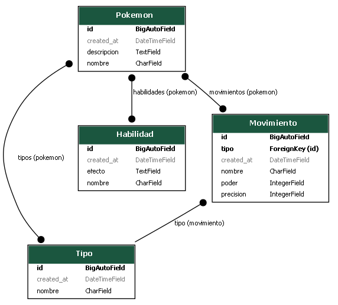

#  Pokémon API

Una API REST construida con Django y Django REST Framework que permite gestionar Pokémon, sus tipos, habilidades y movimientos. Esta API está orientada a funcionar como base para una Pokédex o sistema de entrenamiento.

---

##  Tecnologías utilizadas

- Python 3.x
- Django
- Django REST Framework
- Django Extensions (para generar diagramas de modelos)
- Thunder Client (para probar la API)

---

##  Estructura del proyecto
```
API POKEMON/
├── env/                    # Entorno virtual (carpeta del entorno)
├── POKE/                   # Proyecto Django (settings, wsgi, etc.)
├── pokemon/                # App principal: modelos, vistas, urls
│   ├── __init__.py
│   ├── admin.py
│   ├── apps.py
│   ├── models.py
│   ├── serializers.py
│   ├── tests.py
│   ├── views.py
│   └── api.py
├── db.sqlite3              # Base de datos SQLite
├── documentacion.md        # Instrucciones de instalación y uso
├── manage.py               # Comando de gestión de Django
├── modelo.dot              # Archivo DOT generado con django-extensions
├── modelo.png              # Diagrama de modelo generado con Graphviz
├── README.md               # Documentación general del proyecto
└── requirements.txt        # Dependencias del proyecto
```
---

##  Modelos

- `Tipo`: tipo elemental (ej. Planta, Fuego, Veneno, etc.)
- `Habilidad`: habilidad que puede tener un Pokémon (con efecto)
- `Movimiento`: ataque o movimiento, relacionado con un tipo, poder y precisión
- `Pokemon`: el Pokémon en sí, con múltiples tipos, habilidades y movimientos

---
## Modelo png
## 🧭 Diagrama del Modelo de Datos

A continuación se muestra el diagrama de las relaciones entre los modelos de la app:




## 🔗 Endpoints disponibles

| Método | Endpoint             | Descripción                        |
|--------|----------------------|------------------------------------|
| GET    | /api/pokemon/        | Lista todos los Pokémon            |
| POST   | /api/pokemon/        | Crea un nuevo Pokémon              |
| GET    | /api/pokemon/{id}/   | Detalle de un Pokémon              |
| GET    | /api/tipo/           | Lista todos los tipos              |
| GET    | /api/habilidades/    | Lista todas las habilidades        |
| GET    | /api/movimientos/    | Lista todos los movimientos        |

---

## ⚙️ Instalación

📌 La instalación y configuración del entorno se encuentra en una documentación aparte.

