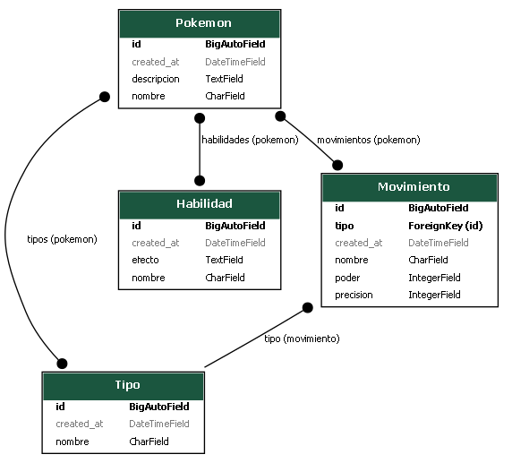

## 🛠️ Tecnologías utilizadas
- Django
- Django REST Framework
- Django Extensions
- Pydot

## Pasos que seguí en el desarrollo

1. **Diseño del modelo entidad-relación**:
   - Analicé qué entidades necesitaba (Pokémon, Tipos, Habilidades, Evoluciones, etc.).


2. **Entorno de desarrollo**:
   - Creé un entorno virtual con `venv`.
   - Instalé las dependencias necesarias: `djangorestframework`, `django-extensions`, `pydot`.

3. **Creación del proyecto Django**:
```bash
   django-admin startproject api_pokemon
   cd api_pokemon
   python manage.py startapp pokemon
```
4. **crear los modelos**
```python 
    from django.db import models
class Tipo(models.Model):
    nombre = models.CharField(max_length=50)
    descripcion = models.TextField()

class Habilidad(models.Model):
    nombre = models.CharField(max_length=50)
    efecto = models.TextField()

class Movimiento(models.Model):
    nombre = models.CharField(max_length=50)
    tipo = models.ForeignKey(Tipo, on_delete=models.CASCADE)
    poder = models.IntegerField()
    precision = models.IntegerField()

class Pokemon(models.Model):
    nombre = models.CharField(max_length=100)
    tipos = models.ManyToManyField(Tipo)
    habilidades = models.ManyToManyField(Habilidad)
    movimientos = models.ManyToManyField(Movimiento)
    evolucion = models.OneToOneField('self', null=True, blank=True, on_delete=models.SET_NULL)

    hacer las migraciones
    python manage.py makemigrations
    python manage.py migrate
```
5. **hacer las migraciones**
```bash
python manage.py makemigrations
python manage.py migrate
```
6. **graficas los modelos**
``` bash
python manage.py graph_models pokemon -o pokemon_models.png
```
## 🗺️ Diagrama entidad-relación

Este es el modelo entidad-relación usado en el proyecto:


## Enpoints disponibles
| Endpoint              | Método   | Descripción                       | Argumentos esperados                                                    |
| --------------------- | -------- | --------------------------------- | ----------------------------------------------------------------------- |
| `/api/pokemons/`      | GET      | Lista todos los Pokémon           | –                                                                       |
| `/api/pokemons/`      | POST     | Crea un nuevo Pokémon             | `nombre`, `tipo_ids`, `habilidad_ids`, `movimiento_ids`, `evolucion_id` |
| `/api/pokemons/<id>/` | GET      | Obtiene un Pokémon específico     | –                                                                       |
| `/api/pokemons/<id>/` | PUT      | Actualiza un Pokémon              | Igual que POST                                                          |
| `/api/pokemons/<id>/` | DELETE   | Elimina un Pokémon                | –                                                                       |
| `/api/tipos/`         | GET/POST | Listado y creación de tipos       | `nombre`                                                                |
| `/api/habilidades/`   | GET/POST | Listado y creación de habilidades | `nombre`                                                                |
| `/api/movimientos/`   | GET/POST | Listado y creación de movimientos | `nombre`, `tipo` (opcional)                                             |

## crear un tipo 
```bash
curl -X POST http://127.0.0.1:8000/api/tipos/ \
  -H "Content-Type: application/json" \
  -d '{"nombre": "Fuego"}'
```
## crear una habilidad 
```bash
curl -X POST http://127.0.0.1:8000/api/habilidades/ \
  -H "Content-Type: application/json" \
  -d '{"nombre": "Mar Llamas"}'
```
## crear un movimiento
curl -X POST http://127.0.0.1:8000/api/movimientos/ \
  -H "Content-Type: application/json" \
  -d '{"nombre": "Lanzallamas"}'
## estructura del proyecto 
API_POKEMON/
│
├── env/                        # Entorno virtual de Python
│
├── POKE/                      # Carpeta del proyecto Django (donde están settings.py, urls.py, etc.)
│   ├── __init__.py
│   ├── asgi.py
│   ├── settings.py
│   ├── urls.py
│   └── wsgi.py
│
├── pokemon/                   # App principal del proyecto 
│   ├── __init__.py
│   ├── admin.py
│   ├── apps.py
│   ├── models.py
│   ├── serializers.py
│   ├── urls.py
│   ├── views.py
│   ├── tests.py
│   └── migrations/
│       └── __init__.py
│
├── db.sqlite3                 # Base de datos SQLite generada automáticamente
│
├── manage.py                  # Script de administración de Django
│
├── modelo.png                 # Imagen generada del diagrama de modelos (graph_models)
│
├── documentacion.md           # Archivo markdown donde documentarás tu API
│
├── documentaction.md          # Posible duplicado del anterior (corrige si es un error tipográfico)
│
├── requirements.txt           # Lista de dependencias del proyecto (recomendado que esté solo una vez)

